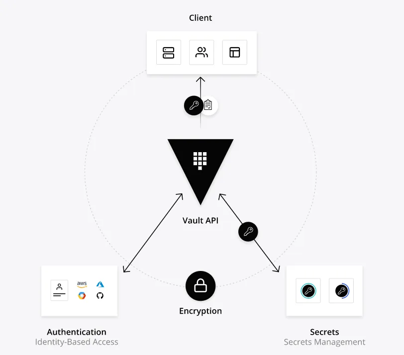

# SecureEnv

Provide a secure environement for developers working whit Credentials you don't have to care about this tools update environment for you

# How does it work?



# Getting Started

Make sure you have to install docker and run the Dockerfile like this run the project like this
```
docker build . -t ${NAME}

docker run -d --network="host"  --name secureEnv ${NAME}
```

# Installation

#### Make sure you installed [Goland](https://go.dev/doc/install) <br />

#### Install Goland dependencies
```shell
go get github.com/hashicorp/vault/api
```
#### Create directory for vault
```shell
mkdir -p $GOPATH/src/github.com/hashicorp && cd $_
```

#### Git clone vault-hashicorp repository
```shell
git clone https://github.com/hashicorp/vault.git
```
#### Change directory in vault
```shell
cd vault
```
#### Make dependencies
```shell
make bootstrap
```

#### Build project
```shell
make dev
```
#### Check vault version
```shell
vault -h
```

# Quickstart

#### Launch vault local server
```shell
vault server -dev
```
Get the Hash from the terminal where you launched the vault server you have to realize a .env like this
```
ADRESS=http://127.0.0.1:8200

HASH=hvs.PA3O9TDvERLIp7U9fNqM9uG8

PATHREAD=${PATH}
```


## Get involved

You're invited to join this project ! Check out the [contributing guide](./CONTRIBUTING.md).

If you're interested in how the project is organized at a higher level, please contact the current project manager.

## Our PoC team :heart:

Developers
| [<br><sub>Toni Da-rodda</sub>](https://github.com/tonida-rodda) | [<br><sub>Florian Damiot</sub>](https://github.com/florianepitech) |
| :---: | :---: |

Manager
| [<br><sub>Adrien Fort</sub>](https://github.com/adrienfort)
| :---: |

<h2 align=center>
Organization
</h2>

<p align='center'>
    <a href="https://www.linkedin.com/company/pocinnovation/mycompany/">
        
    </a>
    <a href="https://www.instagram.com/pocinnovation/">
        
    </a>
    <a href="https://twitter.com/PoCInnovation">
        
    </a>
    <a href="https://discord.com/invite/Yqq2ADGDS7">
        
    </a>
</p>
<p align=center>
    <a href="https://www.poc-innovation.fr/">
        
    </a>
</p>

> :rocket: Don't hesitate to follow us on our different networks, and put a star 🌟 on `PoC's` repositories

> Made with :heart: by PoC